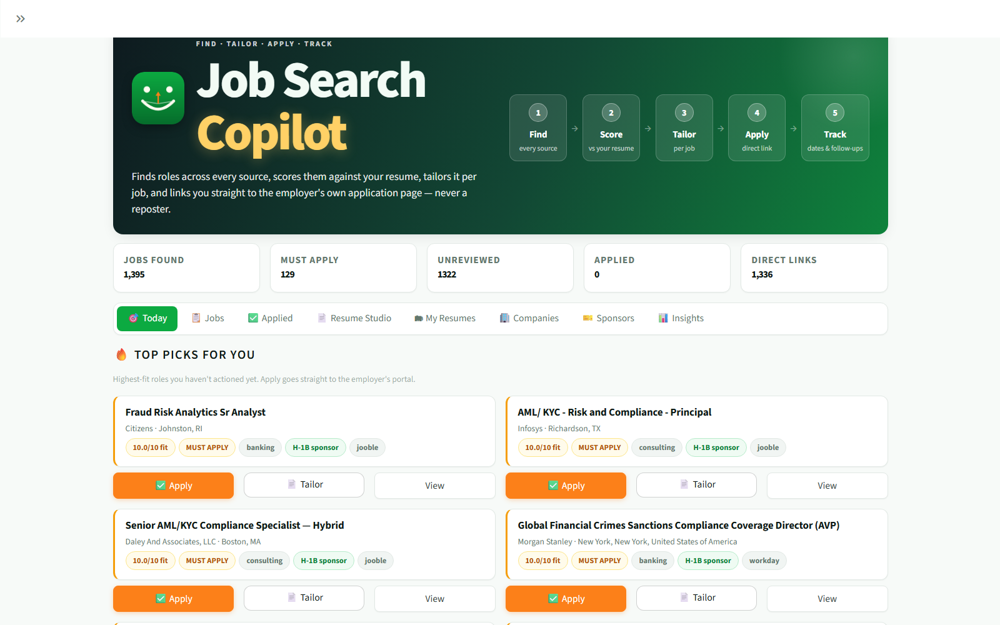
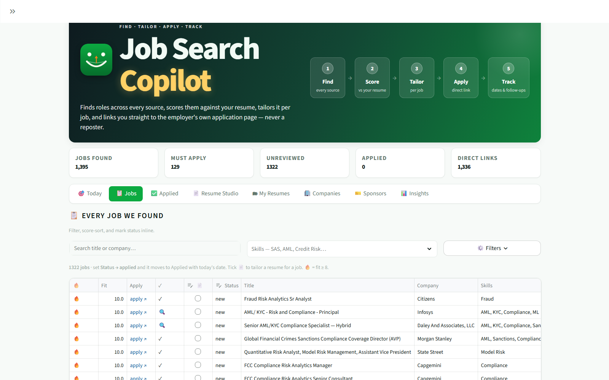
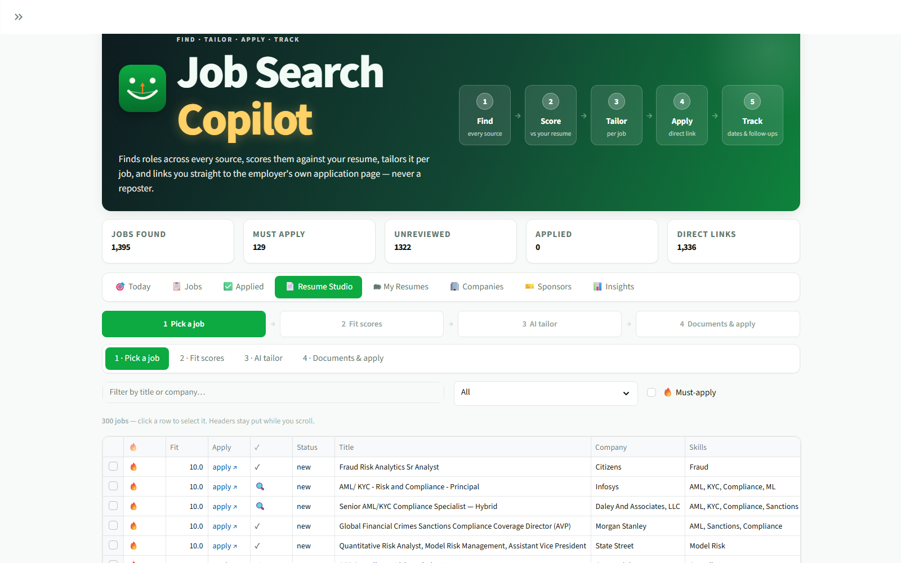
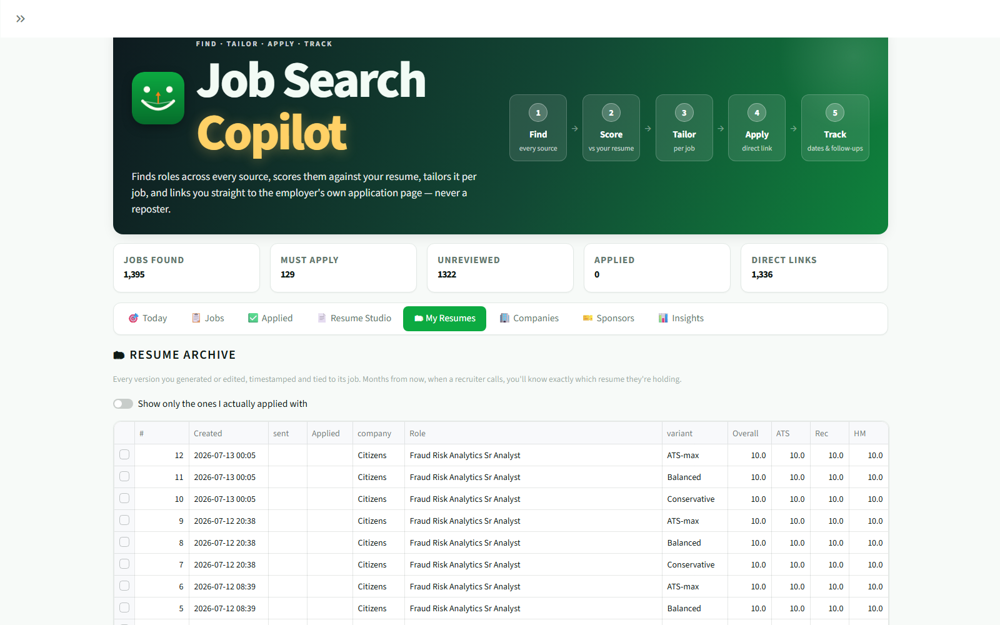
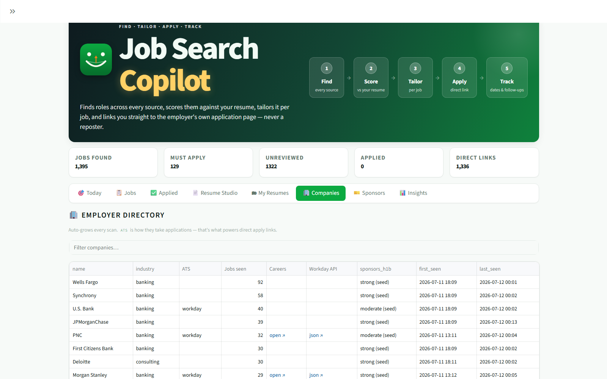
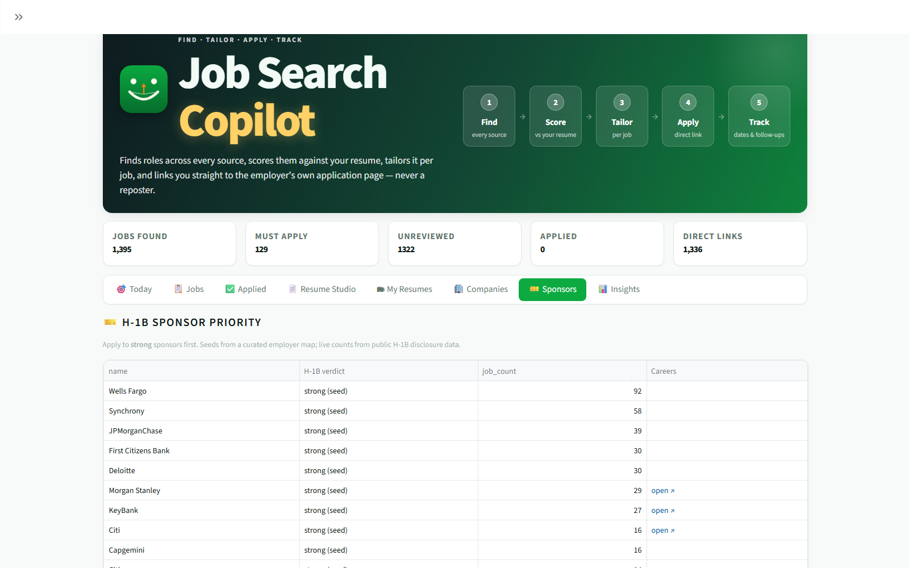

# 🏹 Job Search Copilot

**find · tailor · apply · track** — a local, token-free job-search engine.

It finds roles across every source it can reach, scores each one against *your* resume,
writes and scores tailored versions of that resume per job, links you **straight to the
employer's own application page** (never a reposter), and tracks everything you sent and
when.

Drop in your resume and your keywords. Nothing leaves your machine — the whole thing is
a SQLite file (`data/jobs.db`) and a Streamlit app. AI runs on **free** models
(OpenRouter / Gemini) and degrades gracefully to deterministic scoring when they're
capped, so it never dead-ends.

Not tied to any one industry: the search terms, keywords and employer lists all live in
`config/profile.yml`.

## 🎮 Live demo

*(Live demo link goes here once deployed — see below.)* Runs on a sanitized demo dataset
(`config/profile.demo.yml` + `resume/cv.demo.md` + `data/demo_jobs.db`: a fictional
candidate against 250 real, public job postings) — your own run uses your real resume
and the full pipeline, none of which ever leaves your machine.

**[▶ Full walkthrough video](assets/demo.mp4)** — clicking through all 8 tabs against a live 1,395-job database.

## Screenshots

| | |
|---|---|
| **🎯 Today** — highest-fit picks, apply straight to the employer's own portal | **📋 Jobs** — every job found, filter/sort/status inline |
|  |  |
| **📄 Resume Studio** — pick a job, score fit, AI-tailor, generate docs | **🗂 My Resumes** — every version archived, timestamped, tied to its job |
|  |  |
| **🏢 Companies** — employer directory, ATS auto-discovery | **🎫 Sponsors** — H-1B sponsor priority from public disclosure data |
|  |  |

## Quick start

```bash
pip install -r requirements.txt
cp config/profile.example.yml config/profile.yml   # your keywords + API keys
cp resume/cv.example.md       resume/cv.md         # your resume, in markdown

python run.py            # scrape → score → resolve apply links → data/jobs.db
streamlit run app.py     # open the app
```

Both `config/profile.yml` and `resume/cv.md` are **gitignored** — your keys and your CV
never get committed.

## The pipeline

```
  boards (JobSpy)      ─┐
  Indeed / LinkedIn /   │
  Google Jobs           │
                        │        title + location filter          ┌────────────────┐
  Workday JSON APIs    ─┼──────► dedupe on URL              ─────►│  data/jobs.db  │
  (direct, unblockable) │        fit-score 1–10                   │  jobs          │
                        │        H-1B sponsor tag                 │  companies     │
  Adzuna / Jooble APIs ─┘        salary (FYI)                     │  resumes       │
                                 resolve REAL apply link          └────────┬───────┘
                                                                           ▼
                                                              Streamlit app (app.py)
```

## What makes it different

**Direct apply links.** Aggregators bounce you through third-party reposters that often
can't even take an application. `src/direct_apply.py` resolves a real employer link
for **every** job, in four tiers: already-an-ATS → query the employer's own portal API
(Workday / Greenhouse / Lever / SmartRecruiters / Radancy) → deep-link into their careers
search → their careers page. It discovers each employer's ATS once and remembers it, so
the company directory gets smarter every scan.

**The Workday lane.** Most scrapers only hit Indeed/LinkedIn and get blocked elsewhere.
Every Workday customer exposes a **public JSON careers API**
(`/wday/cxs/{tenant}/{site}/jobs`) — the same endpoint their own careers page calls. It
isn't bot-blocked, costs nothing, and yields hundreds of jobs with full descriptions.

**Resume versions, scored.** For a given job it writes several tailored versions
(Conservative / Balanced / ATS-max) plus your untouched master as a baseline, and scores
each one against that JD from three angles — ATS keyword coverage, recruiter skim,
hiring-manager depth. You *see* what a stronger reframe buys you in points and what it
costs in authenticity, instead of guessing at a slider.

**An authenticity guard.** Every tailored version is checked against your base resume for
skills it doesn't support, numbers it never had, and hype it added. Over-claiming fails
interviews and background checks; this catches it before you send.

**A resume archive.** Every version you generate or edit is stored with a timestamp and
the job it was for. Six months later, when a recruiter calls, you can pull up the exact
resume they're holding.

## Layout

| Path | What it is |
|------|-----------|
| `run.py` | Orchestrator. `--boards` / `--workday` to run one lane; `--sponsors` adds live H-1B lookups. Every run scores, tags sponsors, backfills salary, resolves apply links, archives stale jobs. |
| `app.py` | Streamlit frontend. Presentation only — no business logic. |
| `ui/` | Design system + reusable components. Imports nothing from `src/`, so the frontend is swappable. |
| `src/db.py` | SQLite schema: `jobs` (with your `status` tracker), `companies` (auto-growing directory), `resumes` (the archive). |
| `src/scrape_boards.py` | JobSpy multi-board scraper (proxy-ready). |
| `src/scrape_workday.py` | Workday JSON feeder. Add employers to `TENANTS`; `python -m src.scrape_workday --probe <host> <tenant>` finds the site slug. |
| `src/scrape_apis.py` | Adzuna + Jooble (free keys). |
| `src/direct_apply.py` | The apply-link resolver + ATS discovery. |
| `src/score.py` | Token-free fit score, 1–10. |
| `src/jd_match.py` | JD-vs-resume scoring, sponsorship/location screening. |
| `src/ai.py` | Free-model layer (OpenRouter → Gemini → offline). Includes the authenticity check. |
| `src/variants.py` | Builds and scores the resume versions. |
| `src/resume_store.py` | The resume archive. |
| `src/outreach.py` | Recruiter contact discovery + a `mailto:` draft you review and send. |
| `src/sponsors.py` | H-1B sponsor map + live filing counts (public DOL data). |
| `config/profile.yml` | **All** keywords, search terms, filters, API keys. No code edits needed. |

## On the things this deliberately does *not* do

- **It never submits an application for you.** Assisted apply opens the page and fills
  what it can; you read it and press Submit. Auto-submitters violate site ToS and risk a
  permanent ban on the account you need most.
- **It doesn't scrape LinkedIn for recruiter emails.** That breaks LinkedIn's ToS, risks
  your account, and cold-emailing guessed addresses performs *worse* than a connection
  request you send by hand. It uses contacts the employer **published**, plus optional
  Hunter.io (which has a real GDPR opt-out, unlike a scraped list).
- **It only reads public job data** — the same endpoints careers pages already call.

## Roadmap

1. **More employer portals** — every ATS added to `direct_apply.py` upgrades a whole
   class of jobs from "web search" to "exact posting".
2. **Careers-page auto-resolve** for companies with no ATS match yet.
3. **Interview tracker** — stages and notes on top of the `applied` pipeline.
4. **Swap the frontend** — the SQLite DB is the API; `ui/` is isolated, so React/Next is
   a drop-in replacement.

---

<sub>**Credits.** Board scraping runs on [python-jobspy](https://github.com/speedyapply/JobSpy)
(MIT). The local-first pipeline shape — own the DB, dedupe on insert, age out stale rows —
follows the pattern set by [JobFunnel](https://github.com/PaulMcInnis/JobFunnel). Everything
else here is original; this is not a fork of any project.</sub>
